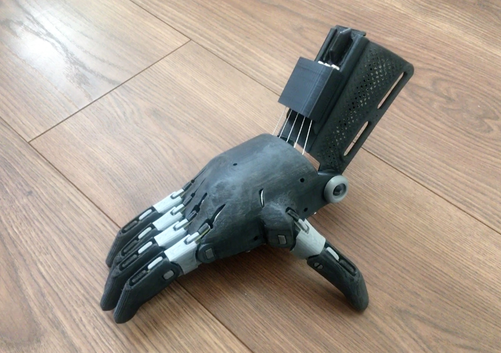

# e-NABLE

e-NABLE is a distributed, open source community that creates and shares designs for assistive devices.

## e-NABLE Herts

While at university I founded a university-based chapter that printed personalised and affordable prosthetics for those with upper limb loss. 

### Phoenix V2
I am certified to produce the [Phoenix V2](https://www.thingiverse.com/thing:1453190#files) design using my Prusa MK3S.

